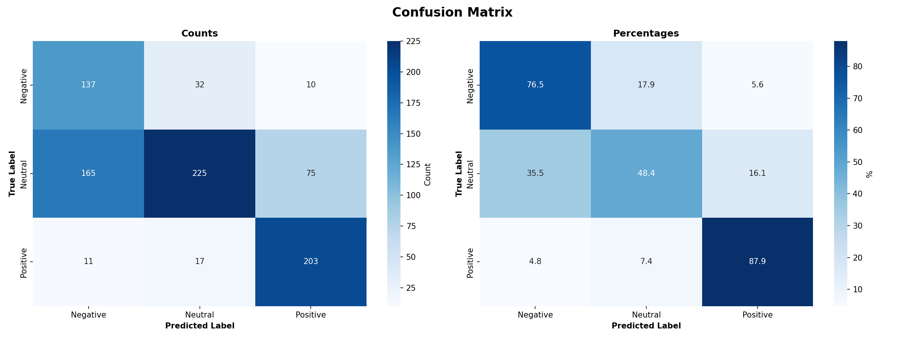

# Czech Facebook Sentiment 

This project implements a sentiment classification model for Facebook comments written in Czech. The system automatically assesses whether each comment is **negative**, **positive**, or **neutral**, and supports **alerting** when the share of negative comments exceeds a given threshold.

The solution is built on a provided Czech pre-trained ELECTRA transformer model.

---

## 1. Problem Overview

**Business Goal:** Create an early-warning system that detects **spikes in negative Czech Facebook comments** so the team can react before issues escalate.

### The Challenge
- **Data Reality:** Historical comments indicate that negative feedback is rare (~20%), with the majority being neutral.
- **Risk:** It is significantly worse to miss a negative comment (false negative) than to flag a neutral one as negative (false positive).
- **Objective:** Train a classifier that prioritizes **recall on negative classes** without sacrificing overall accuracy, and implement a robust alerting mechanism.

Key Objectives:
1. **Train a sentiment classifier** on manually labeled Czech Facebook comments.
2. **Predict sentiment for new Facebook comments**.
3. **Alerting mechanism** for negative sentiment spikes based on rolling windows and confidence thresholds.

---

## 2. Approach & Methodology

The solution follows a rigorous ML pipeline:

### 2.1 Pipeline Steps
1. **Data Preparation**: Text normalization (cleaning emojis/punctuation), tokenization, and splitting into Train (80%) / Validation (10%) / Test (10%) sets.
2. **Model Training**: Fine-tuning a Czech ELECTRA model. We add a custom classification head on top of the transformer backbone.
3. **Evaluation**: validation against unseen test data using specific business-oriented metrics.
4. **Prediction & Monitoring**: Scoring new comments and calculating negative sentiment density over time.

### 2.2 addressing Key Challenges
To ensure the model meets business needs, several specific techniques were applied:

#### A. Handling Class Imbalance
*Problem:* The model initially favored the majority "neutral" class, missing important negative feedback.
*Solution:*
*   **Class Weights:** Applied higher penalties for misclassifying negative instances (approx 1.6x weight) during training.
*   **Focal Loss:** Replaced standard Cross-Entropy loss with **Focal Loss**. This forces the model to focus learning on "hard" examples (often borderline negative comments) rather than easy neutral ones.

#### B. Confidence & Uncertainty
*Problem:* Raw predictions can be noisy.
*Solution:*
*   **Confidence Thresholding:** A comment is only counted towards the negative alert if the model's confidence for "negative" is **≥ 0.55**.
*   **Uncertainty Analysis:** We explicitly track "uncertain" predictions to understand where the model struggles.

---

## 3. Alerting Strategy

A core feature of this system is the "Spike Detection".

*   **Mechanism:** Rolling window of the latest **100 comments**.
*   **Trigger:** An alert is raised if **≥ 30%** of the comments in the window are confidently negative.
*   **Logic:**
    *   Baseline negative rate is ~20%.
    *   A 30% rate represents a **50% increase** in negative sentiment, serving as a statistically significant signal of a potential PR issue.

---

## 4. Project Structure

```text
cz-sentiment-analysis/
├── config.yaml                # Main configuration file (paths, hyperparameters)
├── requirements.txt           # Python dependencies
├── README.md                  # Project documentation
├── scripts/                   # Execution scripts
│   ├── run_pipeline.py        # Main entry point CLI
│   ├── 01_prepare_data.py
│   ├── 02_train_model.py
│   ├── 03_evaluate_model.py
│   ├── 04_predict.py
│   ├── 05_analyze_predictions.py
│   └── 06_flag_negative_comments.py
├── src/                       # Source code library
│   ├── data_utils.py          # Data loading & processing
│   ├── model.py               # Model architecture definition
│   ├── train.py               # Training loop logic
│   ├── predict.py
│   └── utils.py
├── data/                      # Data storage (ignored in git)
│   ├── raw/
│   └── processed/
├── models/                    # Model checkpoints (ignored in git)
└── results/                   # Evaluation artifacts (ignored in git)
```

## 4. Installation

1. **Clone the repository**
   ```bash
   git clone https://github.com/yourusername/cz-sentiment-analysis.git
   cd cz-sentiment-analysis
   ```

2. **Set up environment**
   ```bash
   python -m venv .venv
   source .venv/bin/activate  # On Windows: .venv\Scripts\activate
   pip install -r requirements.txt
   ```

3. **Prepare Data & Models**
   - Labeled and prediction comment files are already in `data/raw/`.
   - Ensure the ELECTRA base model files are present in `models/base_electra/`.

---

## 5. Usage

The project includes a pipeline orchestrator in `scripts/run_pipeline.py`.

**Run the full pipeline (Prepare → Train → Evaluate → Predict → Analyze → Alert):**
```bash
python scripts/run_pipeline.py all
```

**Run individual steps:**
```bash
# 1. Prepare data
python scripts/run_pipeline.py prepare

# 2. Train model (add overrides as needed, e.g. --epochs 4 --lr 1e-5)
python scripts/run_pipeline.py train

# Note: for a theoretical deep-dive into the training process (hyperparameters,
# loss functions, etc.), see notebooks/00_training_methodology_walkthrough.ipynb

# 3. Evaluate model (generates confusion matrix & class reports)
python scripts/run_pipeline.py evaluate

# 4. Predict on new data
python scripts/run_pipeline.py predict

# 5. Analyze predictions (distribution charts, uncertainty reports)
python scripts/run_pipeline.py analyze

# 6. Check alert windows for sustained negatives
python scripts/run_pipeline.py alert
```

## 6. Configuration

All parameters are managed in `config.yaml`.
- **Training**: Epochs, batch size, learning rate, loss function (Focal/CrossEntropy).
- **Paths**: Locations for data and model artifacts.
- **Alerting**: 
    - `window_size`: Size of the rolling window (default: 100).
    - `negative_threshold`: Percentage of negatives to trigger alert (default: 0.3).
    - `confidence_threshold`: Minimum model confidence to count a negative (default: 0.55).

## 7. Metrics & Evaluation Details

- **Metric Focus:** We prioritize **Negative Recall** and **F1-Score**. High accuracy on neutral comments is less valuable than correctly catching distinct negative complaints.
- **Best run (negative recall):** `20251113-225730` — Negative recall ≈ 0.77, F1 ≈ 0.56.
- **Artifacts:**
   - Confusion matrix: `assets/confusion_matrix_best.png`
   - Classification report (visual): `assets/classification_report_best.png`

> Note: The best run was picked intentionally for **negative recall**, accepting a modest drop in neutral performance. The end goal is an **alerting system**, so missing negatives is riskier than over-flagging neutrals.

### Visual snapshots




